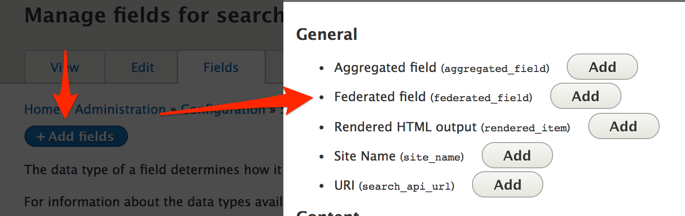

## About this module

This module provides a "Federated field" on Search API indexes, which can be used to aggregate data from different entity types into the same field in the search index.

This is similar to the "Aggregated field" provided by Search API, but gives more direct, token-based control over the values for different entity types.

## Using the "Federated field"

1. Visit the fields list for your index at _Admin > Configuration > Search API > [your index] > Fields_ (path `/admin/config/search/search-api/index/YOUR_INDEX/fields`)
2. Click "Add fields"
3. Click the "Add" button for the "Federated Field":

  
4. Configure field data for each entity type. This field allows token replacement; enter plain text directly or use the token browser to select tokens.

  
5. Save your field.
6. Edit the field label, machine name, and type as necessary for your data
