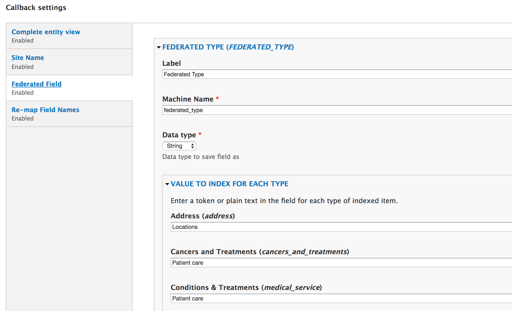
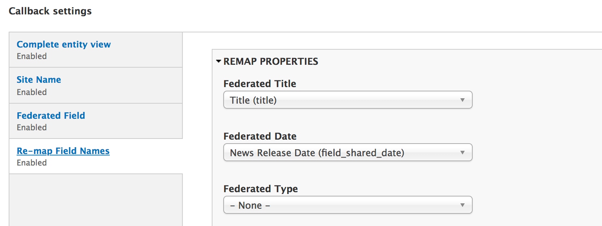

## About this module

This module provides additional properties for Search API indexes. These can be enabled on the "Filters" tab of the Search API index configuration.

### Properties

* **Site Name:** Add the name of the site or the Domain Access Domain to each indexed item.
* **Federated Field:** A field that can be customized per bundle using free text or tokens.
* **Re-map Field Names:** Directly map a field or property (across all bundles) to a new field name in the index. 

After enabling this plugin under the "Data Alterations" section, the indexed values can be customized in the "Callback settings" section of the configuration form.

### Mapping Strategies

Each field being sent to the index should be processed using _only one or the other_ of these two methods. If a field has definitions in both of the following methods, the processing order will determine which data gets sent, and the last definition will override any preceding.

1. For fields that need to be customized per-bundle...
   * Enable the **Federated Field** data alteration as described above.
   * In the callback settings: add a new field, name it according to the [schema](federated_schema.md), and then add values/tokens for each bundle. Bundles left empty will not send any data to the index for this field.
   * Example: This may often be used for the _federated_type_ field when sites have content types that don't match up with those in the schema, so the "News" and "Article" content type can both be mapped to the "News" type in the index.
   
   
   
2. For fields that are being mapped directly across all bundles...
   * Enable the **Re-map Field Names** data alteration as described above.
   * In the callback settings: select the source field from the dropdown of the field being mapped.
   * Example: If the "Title" field of all content types should be mapped directly to the index, select "Title" from the "Federated Title" dropdown.
   
   

----
© Copyright 2018 Palantir.net, Inc.
