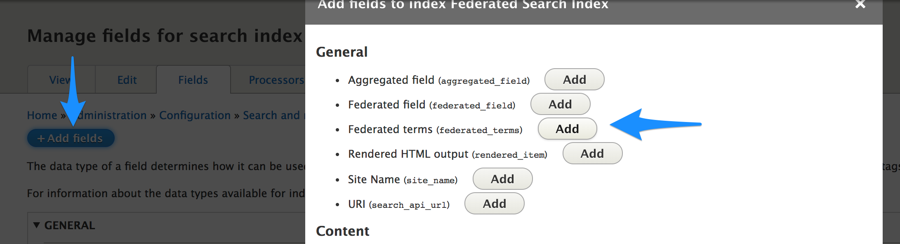
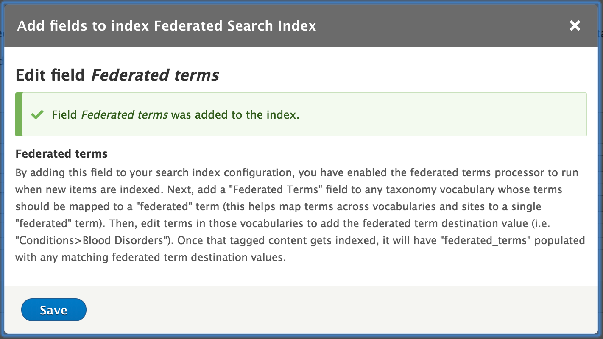
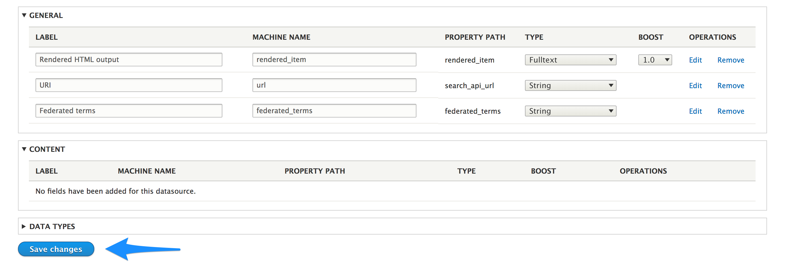

## About this module

This module provides new field options for on SEARCH API indexes:

1. The "Federated field" field can be used to aggregate data from different entity types into the same field in the search index.

    This is similar to the "Aggregated field" provided by Search API, but gives more direct, token-based control over the values for different entity types.
    
    See [Using the "Federated field"](#using-the-federated-field).
1. The "Federated terms" field can be used to assign "federated term" values to any taxonomy term entities within a given site.  See [Using the "Federated terms" field](#using-the-federated-terms-field).

## Using the "Federated field"

1. Visit the fields list for your index at _Admin > Configuration > Search API > [your index] > Fields_ (path `/admin/config/search/search-api/index/YOUR_INDEX/fields`)
2. Click "Add fields"
3. Click the "Add" button for the "Federated Field":

  
4. Configure field data for each entity type. This field allows token replacement; enter plain text directly or use the token browser to select tokens.

  
5. Save your field.
6. Edit the field label, machine name, and type as necessary for your data

## Using the "Federated terms" field

1. Visit the fields list for your index at _Admin > Configuration > Search API > [your index] > Fields_ (path `/admin/config/search/search-api/index/YOUR_INDEX/fields`)
1. Click "Add fields"
1. Click the "Add" button for the "Federated terms":
     
1. Once you have added the "Federated terms" field to your search index configuration, you can read through the provided instructions and save the field:
    
1. Remember to save the index field configuration:
     
1. Configuration for federated terms happens within the taxonomy term entity edit UI itself.  Browse to a taxonomy vocabulary on your site and add an instance of the "Federated terms" field type (If you plan on sharing this field among your vocabularies, use something like "Federated terms" for the field label).
    
1. Edit any terms in the vocabularies to which you've just added a "Federated terms" field instance.  On the term edit form, you should now see a "Federated terms" field instance where you can add one or many "federated" terms.
    
1. Repeat for each term in each vocabulary which should have a federated term value.
1. Once content which references these terms is indexed, all of their corresponding "federated terms" will appear in the `federated_terms` index property field.
